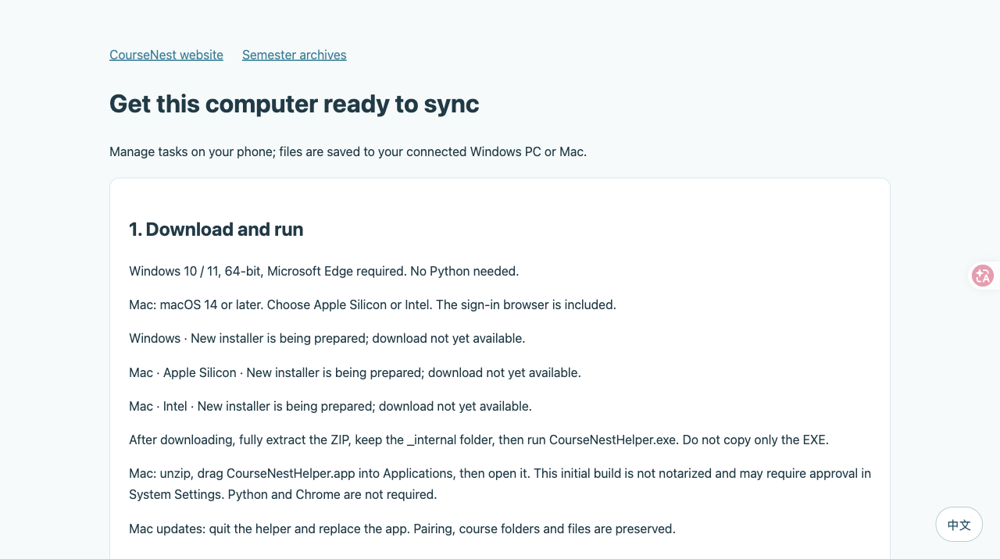
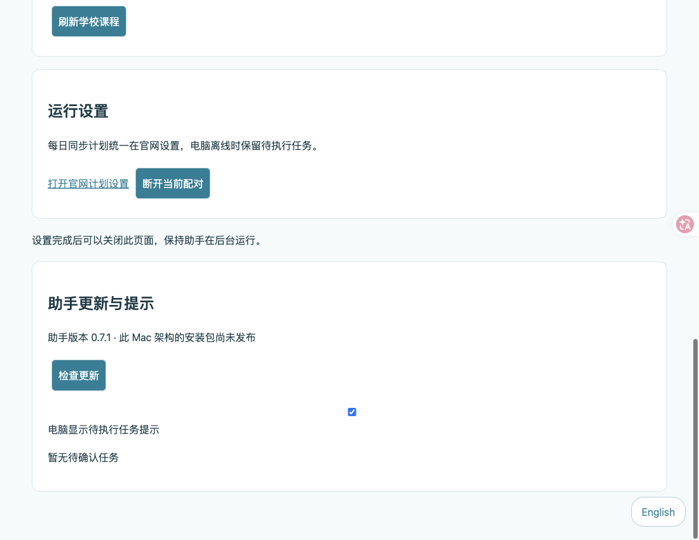

# macOS 助手

支持 macOS 14+，分别提供 Apple Silicon（arm64）和 Intel（x86_64）包。
内置 Python 和 Chromium，无需安装 Python、Chrome 或 Edge。

1. 下载与芯片匹配的 ZIP，完整解压，将 `CourseNestHelper.app` 拖入 `/Applications` 或 `~/Applications`。
2. 双击打开。菜单栏出现 CourseNest；首次打开本地电脑设置，连接学校账号、配置目录并输入官网配对码。
3. 日常在官网管理课程、确认任务和设置每日计划。电脑需开机联网、助手保持运行；睡眠期间不执行下载，恢复联网后继续轮询官网。
4. 可在菜单栏启用“登录后启动”，默认关闭。应用移动后重新启用以更新位置。退出不会立即自动重启。

## 安装提示与更新

初版 CI 包使用 ad-hoc 签名，**未经过 Apple 公证**，不是 Developer ID 发行包。macOS 可能阻止首次打开；确认包来源和 SHA-256 后，在系统设置“隐私与安全性”中按系统提示允许打开。不需要全局关闭 Gatekeeper。

Mac 首版只检查更新。点击“下载新版”，等待任务结束，从菜单栏退出助手，然后替换 Applications 中的应用。当前 Windows 自动安装、升级回滚机制不会在 Mac 上运行。

账号密钥存放在登录钥匙串；会话加密保存。系统询问钥匙串访问时可以允许；拒绝后可重新尝试登录。不同 ad-hoc 构建更换后可能重新询问访问权限。
数据库、配对、会话和设置位于 `~/Library/Application Support/BNBUCourseNest`，课程文件位于自己选择的目录。替换应用不会删除它们。不要把课程目录选在应用或账号数据目录内。

目录窗口取消不会修改设置；没有看到窗口可粘贴绝对路径。首次访问 Documents/Desktop 或外置磁盘时，按 macOS 提示授权；权限被拒绝或磁盘离线时重新选择可写目录。

提示通知通过系统 AppleScript 通知发送，权限可能归属于 Script Editor/系统脚本服务；通知被系统关闭时，菜单栏待确认数量和设置页面仍可查看任务。

## 从源码构建

在目标架构的 Mac 上使用原生 Python 3.13，不进行跨架构冻结：

```sh
python3.13 -m venv .venv
.venv/bin/python -m pip install -r requirements.lock -r requirements-build.lock
.venv/bin/python -m pip install --no-deps -e .
.venv/bin/python scripts/build_assistant_macos.py
.venv/bin/python scripts/check_bundle.py
```

产物为 `dist/CourseNestHelper-<version>-macos-<arch>.zip` 及 `.zip.sha256`。
构建仅收集锁定版本 Chromium，保留浏览器 Framework、符号链接及执行权限，不将开发环境或用户数据打包。
应用主程序提供兼容 CLI，可用于隔离端口的包内测试。开发态登录需先运行 `python -m playwright install chromium`。

## 维护者发行

- Apple 签名和原有 Ed25519 更新元数据签名用途不同，两者不能互相替代。
- 可选设置 `MACOS_SIGNING_IDENTITY` 为 Developer ID Application 身份；设置 `MACOS_NOTARY_PROFILE` 为已经通过 `xcrun notarytool store-credentials` 保存在钥匙串中的 profile 名。构建脚本会签名、提交公证、staple 并验证，再重新打 ZIP。未配置公证时产物始终标注未公证。
- 本 PR 不包含证书、私钥或生产部署。Apple 签名/公证分支须由持有证书的维护者实际验证后发行。
- 使用现有、与客户端公钥匹配的 `.runtime/release-signing.key` 执行 `python scripts/prepare_release.py --platform macos --arch arm64`，Intel 使用 `--arch x86_64`。不得生成新密钥替换固定公钥。
- 上传包到现有 `linwu008/coursenest-releases` 仓库的对应版本标签。将生成的 JSON 分别配置为 Worker 变量 `HELPER_MACOS_ARM64` 和 `HELPER_MACOS_X86_64`。变量缺失或无效时下载页显示尚未发布，不回退到 Windows。
- `/api/helper?platform=macos&arch=arm64` 与 `/api/v07/update?platform=macos&arch=arm64` 提供对应元数据；不带参数仍保留 Windows 行为。Mac 增加 `update-check-v1` 能力，不宣称 `update-v1` 自动安装能力。
- GitHub PR CI 无需 secrets，只测试、构建并上传 CI artifacts，不发布 GitHub Release、不修改官网。

## 卸载

先在菜单栏关闭登录后启动，再退出并移除应用。保留课程和账号数据以便重装；若应用已移除，可手动移除 `~/Library/LaunchAgents/cn.bnbucoursenest.helper.plist`。

## 本次本机验收记录（2026-10-02）

Apple Silicon / macOS 27.0.1 / Python 3.13：147 项 Python 测试通过、2 项 Windows 专用测试跳过；32 项云端测试通过；v3、v4、v5、v6、v7、public、v1 七组浏览器回归通过。
从生成 ZIP 解压后通过 `codesign --verify --deep --strict`、包内本地服务及 Chromium 模拟登录（无头与可见窗口）检查。使用独立随机服务名完成真实 Keychain 写入、读取、删除，不接触已有学校凭据。冻结后的 GUI 启动器提供本地设置页，重复启动使用同一服务。

尚未完成的人工验收：菜单栏逐项点击与正常退出、真实登录会话中的登录启动、系统权限拒绝、外置盘断开及真实学校账号同步。原生 UI 自动化接口超时，不能将这些项目记为通过。Intel 与 Windows 的结果以 PR 所链接的原生 CI 为准；Developer ID 签名、公证需要维护者证书。




